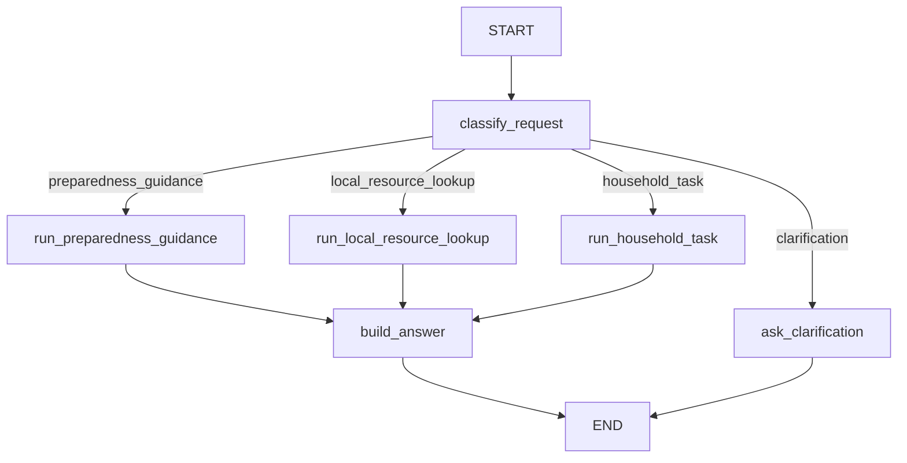

## Framework Choice

Selected framework: LangGraph.

Why LangGraph:

- it models agentic workflows as a graph, which matches the assignment language:
  State, Nodes, Edges, and conditional routing;
- state is explicit and typed with `TypedDict`;
- conditional edges make routing visible instead of hiding all control flow in
  nested `if/else` blocks;
- it scales better than a single custom function once the workflow grows beyond
  a few steps or starts to need retries, multi-step tool use, or human approval.

LangGraph adds some boilerplate, but it makes the
workflow structure easier to inspect.

## Domain Area And Use Case

Domain area: household emergency preparedness assistant.

Concrete use case: a user asks the assistant for emergency preparedness help.
The assistant classifies the request and routes it to one of three main
workflows:

- stable preparedness guidance;
- dynamic local emergency resource lookup;
- household preparedness task creation.

If the request is unclear or misses required inputs, the graph routes to
clarification.

## Graph Schema

```text
START
  -> classify_request
  -> conditional edge by selected_route
      -> run_preparedness_guidance
      -> run_local_resource_lookup
      -> run_household_task
      -> ask_clarification
  -> build_answer
  -> END
```

Clarification route:

```text
START -> classify_request -> ask_clarification -> END
```

Mermaid diagram:



## State Definition

The shared state is defined in `scripts/langgraph_flow.py` as `AgentState`.

```python
class AgentState(TypedDict):
    user_question: str
    selected_route: str
    route_reason: str
    extracted_entities: dict[str, Any]
    missing_inputs: list[str]
    tool_result: dict[str, Any]
    final_answer: str
    executed_nodes: Annotated[list[str], operator.add]
    observations: Annotated[list[dict[str, Any]], operator.add]
```

`executed_nodes` and `observations` use LangGraph reducers so each node can append
trace information without overwriting previous steps.

## Nodes

| Node | Responsibility |
|---|---|
| `classify_request` | Classifies the user question, extracts entities, stores route and missing inputs |
| `run_preparedness_guidance` | Calls the mock knowledge-base retrieval tool |
| `run_local_resource_lookup` | Calls the mock local emergency resource tool |
| `run_household_task` | Calls the mock task creation tool |
| `ask_clarification` | Builds a clarification answer when input is incomplete or ambiguous |
| `build_answer` | Converts the latest tool result into the final user-facing answer |

## Edges

Normal edges:

- `run_preparedness_guidance -> build_answer`
- `run_local_resource_lookup -> build_answer`
- `run_household_task -> build_answer`
- `build_answer -> END`
- `ask_clarification -> END`

Conditional edge:

```python
workflow.add_conditional_edges(
    "classify_request",
    route_after_classification,
    {
        "preparedness_guidance": "run_preparedness_guidance",
        "local_resource_lookup": "run_local_resource_lookup",
        "household_task": "run_household_task",
        "clarification": "ask_clarification",
    },
)
```

## Mock Tools

The graph uses deterministic mock tools, so no API keys are needed.

| Tool | Input | Output |
|---|---|---|
| `search_preparedness_knowledge_base` | User question | Best matching mock chunk with `chunk_id`, `title`, `section`, `score`, `content` |
| `lookup_local_resource` | `location_code`, `resource_type` | Structured local resource data with status, address/contact fields, and verification timestamp |
| `create_household_task` | `task_type`, `owner`, `due_date` | Mock task with `task_id`, `status`, `title`, `owner`, `due_date`, and `next_steps` |

## How To Run

Install dependencies:

```bash
python3 -m pip install -r requirements.txt
```

Generate the required examples:

```bash
python3 scripts/langgraph_flow.py --write-examples
```

Run one question:

```bash
python3 scripts/langgraph_flow.py --question "Which shelter is open in springfield_oh tonight?"
```

## Test Examples

The required 3 examples are stored in:

```text
outputs/langgraph_examples.md
```

They cover:

1. `preparedness_guidance` route:
   `What should I put in my emergency kit for prescription medication?`
2. `local_resource_lookup` route:
   `Which shelter is open in springfield_oh tonight?`
3. `household_task` route:
   `Create a task for me to check smoke detectors by Friday.`

Each example includes:

- input question;
- selected route;
- executed nodes;
- final state;
- final answer;
- observations from each node.

## Custom Flow vs LangGraph

| Aspect | Custom flow from HW6 | LangGraph implementation |
|---|---|---|
| Code size | Smaller and easier for a tiny workflow | More boilerplate: state type, graph builder, edges |
| Workflow visibility | Control flow is inside one Python function | Graph structure is explicit through nodes and edges |
| State handling | Manual dictionary mutation | Typed state with reducers for trace fields |
| Conditional routing | `if/elif/else` inside code | Explicit conditional edge after `classify_request` |
| Debugging | Need custom prints or manual traces | `executed_nodes` and `observations` show graph path clearly |
| Extensibility | Simple until routes grow | Better when adding more nodes, retries, approval, or parallel branches |
| Learning value | Best for understanding the raw loop | Best for understanding how frameworks structure the same loop |

Conclusion: the custom flow is better for a very small 2-3 step demo because it
has almost no framework overhead. LangGraph becomes more useful when the workflow
has multiple branches, needs durable state, or needs to show a clear route graph.
Edges, and conditional routing much easier to explain and grade.

## Grading Checklist

| Requirement | Where implemented |
|---|---|
| Framework workflow runs locally | `scripts/langgraph_flow.py` with `requirements.txt` |
| State defined and used | `AgentState` in `scripts/langgraph_flow.py` |
| Minimum 2 nodes and 1 conditional edge | 6 nodes and one `add_conditional_edges` call |
| 3 examples with tracing | `outputs/langgraph_examples.md` |
| Custom vs framework comparison | README section "Custom Flow vs LangGraph" |
